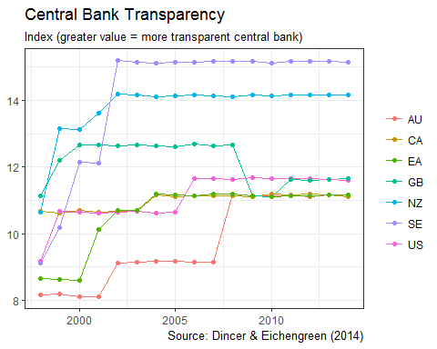

Central Bank Transparency Data
==============================

This package contains the dataset on central bank transparency from [Dincer and Eichengreen (2014)](http://eml.berkeley.edu/~eichengr/data.shtml).

The maintainer of this package is unaffiliated with those authors, so if you use the data please cite it accordingly:

> Dincer and Eichengreen, "Central Bank Transparency and Independence: Updates and New Measures", International Journal of Central Banking, Vol. 10, No. 1: 189-259, March 2014.

Installation and example usage
==============================

To install the package from Github:

``` r
devtools::install_github("expersso/cbtransparency")
```

``` r
library(cbtransparency)
library(dplyr)
library(ggplot2)

head(transp)
#> # A tibble: 6 × 5
#>          country  year value                measure iso2c
#>            <chr> <dbl> <dbl>                  <chr> <chr>
#> 1         Africa  1998   2.6 Transparency by Region  <NA>
#> 2 Eastern Africa  1998   2.0 Transparency by Region  <NA>
#> 3       Ethiopia  1998   1.0 Transparency by Region    ET
#> 4          Kenya  1998   2.5 Transparency by Region    KE
#> 5         Malawi  1998   1.0 Transparency by Region    MW
#> 6      Mauritius  1998   4.0 Transparency by Region    MU

countries <- c("EA", "US", "GB", "SE", "AU", "NZ", "CA")

df_plot <- transp %>%
  filter(measure == "Augmented Transparency by Region") %>%
  filter(iso2c %in% countries) %>% 
  mutate(value = value + runif(length(value), 0.1, 0.2))

ggplot(df_plot, aes(x = year, y = value, color = iso2c)) +
  geom_line() +
  geom_point() +
  theme_bw() +
  labs(x = NULL, y = NULL, color = NULL,
       title = "Central Bank Transparency", 
       subtitle = "Index (greater value = more transparent central bank)",
       caption = "Source: Dincer & Eichengreen (2014)")
```


